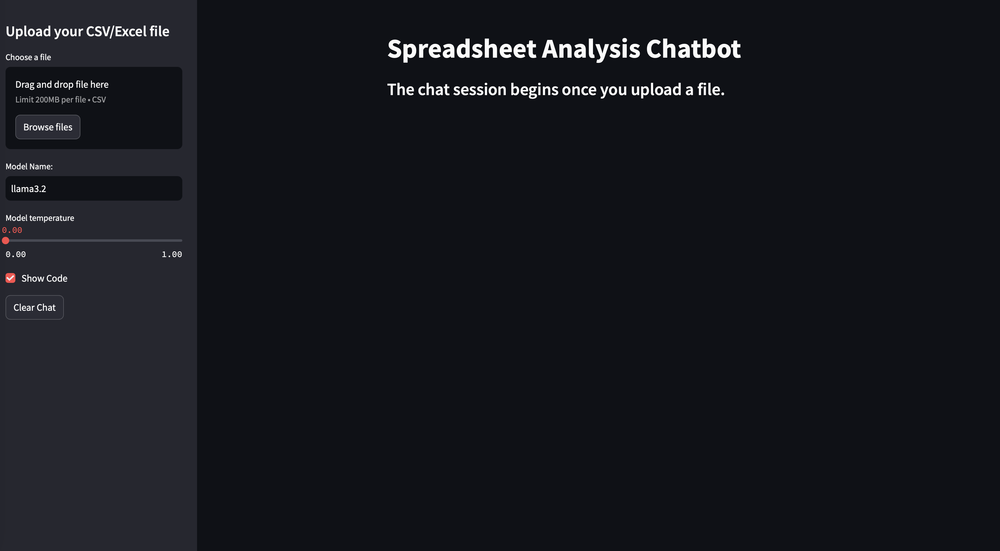
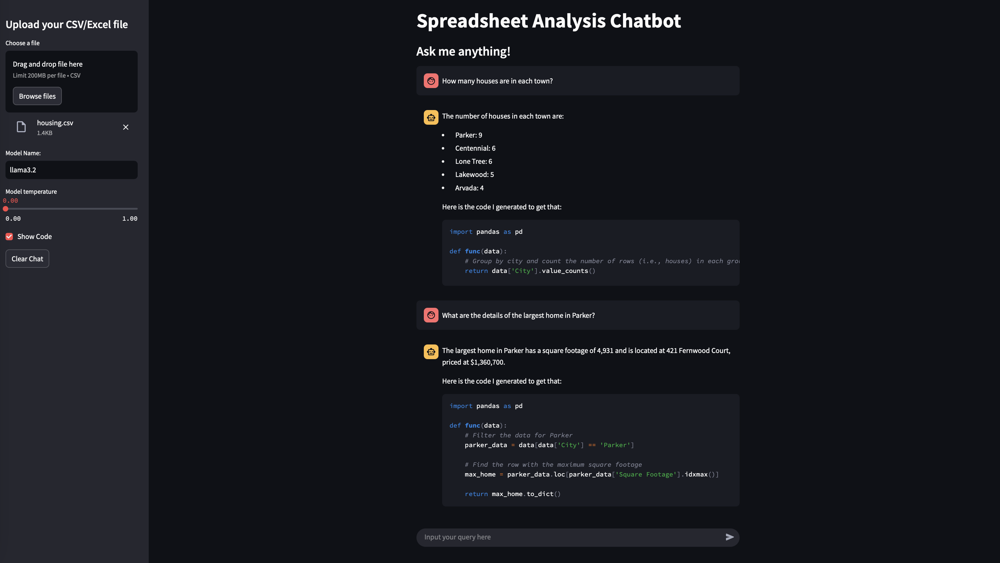
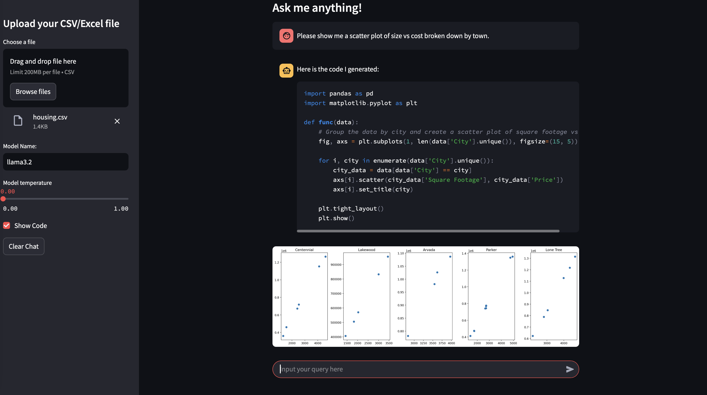

## LLM Sheet Analysis

This is a repository for utilizing an LLM to write and execute code related to spreadsheet analysis (CSVs and Excel files).

### Caution

This is a prototype. It is able to write and execute code which is an inherent risk. There are some basic safeguards in place which will be discussed [later](#potential-risks).

### Prerequisites

All LLM inference in this repository is currently handled by Ollama and OpenAI. This means you have to install Ollama and run a model (llama3.2 is recommended). Follow the instructions in [this blog](https://medium.com/@sridevi17j/step-by-step-guide-setting-up-and-running-ollama-in-windows-macos-linux-a00f21164bf3). We use the OpenAI Python API for easy communication in the container.

### Getting Started

This was originall developed in an anaconda environment but has been updated to operate in docker for safety. You can run the following code to get started:

```bash
make build
```

This will build the docker image and install a local Python package `sheet_analysis`.

### Streamlit App

In the main level of the directory, there is a code ["main.py"](main.py). This can be accessed by running `make app` in the terminal. Once you select the Local URL ([http://localhost:8501](http://localhost:8501)), the Streamlit app will come up in your browser. It looks like this:



Once you upload a CSV or XLSX file, the chat bar will pop up. On the side bar, there are options for model name, temperature, and whether or not you want to see the generated code. It is important to note that the model name must match with a model that you have locally downloaded with Ollama.

Once everything is set, you can begin to ask questions to the model. The data is already loaded, so the model will generate code required to answer the question, run it, and return the answer. If you have selected to show code, it will show you the code with the answer. Here is an example of some questions on the sample data.



Currently, the model is not exposed to the chat history. This can cause some limitations if you desire the ability to have a more natural flowing conversation, but this is intended for small, locally-run models. The final example here shows the capability for the model to generate visualizations.



### Potential Risks and Safeguards

There are inherent risks with allowing a model to write code that is blindly executed. There are three basic safeguards currently in place.

1. This operates in a docker container under the user `nobody`. It should not have much access to do anything and is not exposed to files outside of the "llm-sheet-analysis" directory.

2. In the code generation prompt, we tell the model it only has access to `pandas`, `numpy`, `datetime`, `re`, `sklearn`, `matplotlib`, and `scipy`.
    - These packages should not have things that can necessarily be used nefariously by an LLM (to my knowledge).
    - Furthermore, it is unlikely that llama3.2 will generate nefarious code when prompted the way it is: analyze this DataFrame.

3. There are import checks conducted to ensure that the only imports come from these packages.
    - If the generated code imports any other packages, an error is raised, and the code is not executed.

As previously mentioned, these are very basic safeguards. Use at your own risk.

### Next Steps

These are items that are planned to be added/updated.

1. Add better safeguards.
    - There are likely packages out there that can address some of the aforementioned concerns.

2. Implement other LLM communication methods.
    - This currently only handles Ollama-hosted models using OpenAI API.